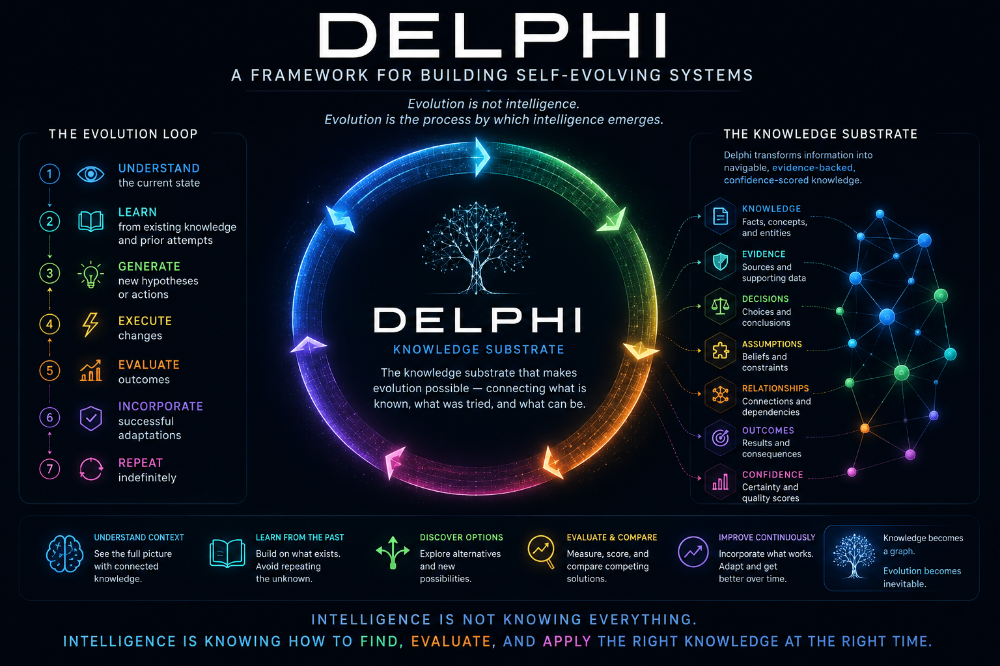

<p align="center">
  
</p>

# Delphi

**A framework for building self-evolving systems.**

> Evolution is not intelligence. Evolution is the process through which
> intelligence emerges.

Most AI projects start with agents. Delphi starts with **evolution**. We believe
that any system capable of continuously executing the following loop can improve
over time:

1. Understand the current state
2. Learn from existing knowledge and prior attempts
3. Generate new hypotheses or actions
4. Execute changes
5. Evaluate outcomes
6. Incorporate successful adaptations
7. Repeat indefinitely

The challenge is that evolution requires knowledge. A system cannot improve
itself if it cannot understand what already exists, what has been tried before,
why decisions were made, what assumptions were made, and what consequences
followed. This leads to a fundamental question:

> What is knowledge, and how can it be represented in a way that makes it
> searchable, navigable, evaluable, and reusable by both humans and autonomous
> systems?

**Delphi is our answer.** Delphi is a knowledge substrate for self-evolving
systems. It represents knowledge, evidence, decisions, assumptions,
relationships, outcomes, and confidence as interconnected structures that can be
explored, reasoned about, and improved over time.

Rather than treating information as documents, chats, tickets, or databases,
Delphi transforms information into navigable, evidence-backed, confidence-scored
knowledge. Knowledge becomes a graph rather than a collection of files. This
allows agents and humans to:

- Understand context
- Learn from previous work
- Discover alternative approaches
- Evaluate competing solutions
- Measure outcomes
- Continuously improve future decisions

The goal is not to create smarter agents. The goal is to create systems capable
of continuous, self-directed evolution; agents are merely one mechanism through
which that evolution occurs.

> Intelligence is not knowing everything. Intelligence is knowing how to find,
> evaluate, and apply the right knowledge at the right time.

**Databases solved persistence. Delphi aims to solve adaptation.**

Read the full [MANIFESTO.md](./MANIFESTO.md), the working agreement in
[AGENTS.md](./AGENTS.md), and the specification in `rfcs/` (start at
`rfcs/RFC-9999-Delphi-Specification-Index.md`). This MVP implementation follows
`rfcs/DELPHI-MVP-0001-First-Implementation-Plan.md`.

### Delphi evolves itself

This repository is its own proof. Its knowledge is a live Delphi Brain
(`brain/`), and an autonomous daemon runs the seven-step loop against the repo
continuously — scanning for knowledge gaps and goals, dispatching agents to
close them, evaluating the result against rubrics, and incorporating what passes
back into the Brain and the codebase. Humans approve only actions that affect
outside parties (see [CONSTITUTION.md](./CONSTITUTION.md)); everything else is
autonomous.

## Stack

- TypeScript (strict), ESM, pnpm workspaces
- PostgreSQL via `DATABASE_URL`, or embedded PGlite when unset (zero setup)
- Anthropic API when `ANTHROPIC_API_KEY` is set; deterministic heuristic
  extraction/summarization otherwise (fully offline-capable)

## Layout

| Path | Role |
|---|---|
| `packages/delphi-protocol` | Zod contracts for all RFC primitives + confidence math |
| `packages/delphi-knowledge` | Storage: Db interface (pg / PGlite), migrations, BrainStore |
| `packages/delphi-ingestion` | Files → Assets + Chunks (frontmatter-aware, checksum-idempotent) |
| `packages/delphi-extraction` | Chunks → Candidates → resolution (merge/create/link/flag) → Leaves + Evidence (RFC-0027) |
| `packages/delphi-indexer` | Regions (seeded + hub), 4-tier indexes, maps, debounced scheduler (RFC-0028) |
| `packages/delphi-agent` | Question → index navigation → leaves → evidence → answer (RFC-0008) |
| `apps/api` | Fastify HTTP API (RFC-0014 subset) |
| `examples/tigerbeetle` | Self-contained demo corpus |

## Run

```bash
pnpm install
pnpm bt        # typecheck + all tests
pnpm demo      # ingest examples/, build indexes+maps, answer a question
pnpm api       # start the HTTP API on :3001
```

The demo works with no environment configuration. Set `ANTHROPIC_API_KEY`
to switch extraction/summarization/answers to LLM quality; set
`DATABASE_URL` to use a real Postgres.

## License

MIT — see [LICENSE.md](./LICENSE.md).
