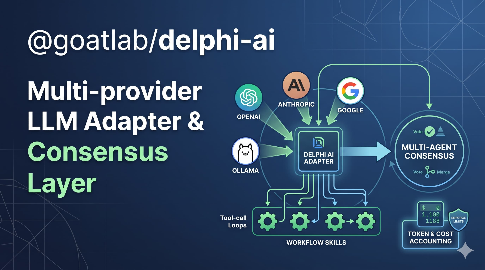

<p align="center">
  
</p>

# @goatlab/delphi-ai

Multi-provider LLM adapter and multi-agent consensus layer for the Goat workflow engine. Unifies OpenAI, Anthropic, Google, and Ollama behind a single interface, with structured tool-call loops integrated into `@goatlab/delphi-core` workflows.

## What it is

A thin, opinionated layer on top of the Vercel AI SDK that:

- Provides a uniform `LLMAdapter` across OpenAI, Anthropic, Google, and Ollama
- Runs tool-call loops that dispatch to workflow skills (typed functions the LLM can invoke)
- Supports multi-agent consensus via `AgreementOrchestrator` (propose → critique → vote → commit)
- Exposes token/cost accounting so `@goatlab/delphi-core` budgets can enforce limits
- Includes circuit breakers and retry-with-backoff for resilient LLM calls

## Install

```bash
pnpm add @goatlab/delphi-ai @goatlab/delphi-core
# Plus your provider of choice:
pnpm add @ai-sdk/openai @ai-sdk/anthropic @ai-sdk/google ollama-ai-provider
```

Set provider API keys as environment variables (`OPENAI_API_KEY`, `ANTHROPIC_API_KEY`, `GOOGLE_GENERATIVE_AI_API_KEY`, or configure Ollama host).

## Quick start

```ts
import { LLMAdapter } from '@goatlab/delphi-ai'

const adapter = new LLMAdapter()

const result = await adapter.chat({
  provider: 'anthropic',
  model: 'claude-sonnet-4-6',
  messages: [
    { role: 'system', content: 'You are a concise assistant.' },
    { role: 'user', content: 'Summarize the concept of eventual consistency.' },
  ],
})
console.log(result.content, result.usage)
```

### Model presets

```ts
// Use a named preset instead of specifying provider + model
const result = await adapter.chatFromPreset('fast', [
  { role: 'user', content: 'Quick summary of CAP theorem.' },
])
```

## Integration with `@goatlab/delphi-core`

Register as a step executor via `createEngine` so workflow steps can call LLMs with full state persistence, retries, and budget enforcement:

```ts
import { createEngine, Workflow, step } from '@goatlab/delphi-core'
import { AIStepExecutor } from '@goatlab/delphi-ai'

// Define a step that uses the AI executor
class SummarizeStep extends Step<{ text: string }, { summary: string }> {
  stepName = 'summarize' as const
  executorType = 'ai'  // routes to AIStepExecutor
}

// Wire into the engine
const engine = createEngine({
  database: process.env.DATABASE_URL,
  workflows: [SummarizeWorkflow] as const,
  tenantId: 'default',
  extraExecutors: new Map([['ai', new AIStepExecutor()]]),
})
```

The `executorConfig` on the step controls the LLM call:

```ts
class SummarizeWorkflow extends Workflow<{ text: string }> {
  workflowName = 'summarize' as const
  steps = [
    step(new SummarizeStep(), {
      // executorConfig passed to AIStepExecutor.execute()
    }),
  ] as const
}
```

When used inside a workflow step:
- Token and cost usage are reported via `StepResult.usage` and deducted from the run's budget
- Tool calls go through `@goatlab/delphi-core`'s external-action machinery (exactly-once, replayable)
- The step weight `'ai'` routes to the `workflow_step_ai` queue for worker specialization

## Tool-call loop with skills

Skills are typed functions that the LLM can invoke. The `AIStepExecutor` runs the classic call-loop until the model emits a final answer (no more tool calls).

```ts
import { SkillRegistry } from '@goatlab/delphi-core'
import { AIStepExecutor } from '@goatlab/delphi-ai'

const skills = new SkillRegistry()
skills.register({
  name: 'searchDocs',
  description: 'Search internal documentation',
  parameters: { type: 'object', properties: { query: { type: 'string' } } },
  execute: async ({ query }) => ({ results: await myDocsSearch(query) }),
})

const executor = new AIStepExecutor({ skills })
```

The executor runs inside a workflow step. Each tool invocation is persisted through delphi-core's external-action machinery — making tool calls exactly-once, replayable, and budget-aware.

## Multi-agent consensus

Run N agents through a structured agreement protocol — propose, critique, vote, and converge:

```ts
import { AgreementOrchestrator, AgentRole } from '@goatlab/delphi-ai'

const orchestrator = new AgreementOrchestrator(
  {
    sessionId: 'review-123',
    maxTurns: 5,
    maxDurationMs: 60_000,
    tokenBudgetPerTurn: 5000,
    minConsensusScore: 0.7,
    conflictResolution: 'majority',
  },
  [
    { id: 'gpt4', role: AgentRole.PROPOSER, weight: 1, execute: gpt4Agent },
    { id: 'claude', role: AgentRole.REVIEWER, weight: 1, execute: claudeAgent },
    { id: 'gemini', role: AgentRole.REVIEWER, weight: 1, execute: geminiAgent },
  ],
)

const result = await orchestrator.runAgreement('Draft three options for the email subject line.')
// result.consensus.method: 'unanimous' | 'majority' | 'arbiter' | 'timeout'
// result.consensus.score: 0.0 - 1.0
// result.auditTrail: full message history
```

### Agreement protocol

The protocol follows a state machine: `PROPOSE → CRITIQUE → CONVERGE → COMMIT | ABORT`

| Phase | What happens |
|-------|-------------|
| **Propose** | Proposer agent generates initial content with confidence score |
| **Critique** | All reviewer agents critique in parallel — approve, refine, or reject |
| **Converge** | Weighted votes collected, consensus score calculated |
| **Commit/Abort** | If score >= threshold → commit. Otherwise loop back to propose (refine). Abort on timeout, max turns, or risk guard trip. |

### Risk guard

The `RiskGuard` provides safety rails during multi-agent deliberation:
- Token budget enforcement per turn
- Circuit breaker per agent (max errors before trip)
- Cyclical argument detection (identical proposals = stuck loop)

The `AgreementStepExecutor` wires the orchestrator into delphi-core as `executorType: 'agreement'`, so consensus runs as a workflow step with full durability.

## Resilience

### Circuit breaker

Per-provider circuit breaker prevents cascading failures:

```ts
import { CircuitBreaker } from '@goatlab/delphi-ai'

const breaker = new CircuitBreaker({
  failureThreshold: 5,     // open after 5 failures
  resetTimeoutMs: 30_000,  // try again after 30s
})
```

### Retry with backoff

Retryable errors (rate limits, transient failures) are automatically retried with exponential backoff:

```ts
import { retryWithBackoff } from '@goatlab/delphi-ai'

const result = await retryWithBackoff(
  () => adapter.chat({ ... }),
  { maxRetries: 3, initialDelayMs: 1000 },
)
```

## Testing

```bash
pnpm test   # 63 tests, no containers needed — providers are mocked at the SDK boundary
```

## Key exports

| Export | Purpose |
|---|---|
| `LLMAdapter` | Provider-agnostic chat interface (OpenAI, Anthropic, Google, Ollama) |
| `AIStepExecutor` | Plug into delphi-core as `executorType: 'ai'` |
| `AgreementStepExecutor` | Plug into delphi-core as `executorType: 'agreement'` |
| `AgreementOrchestrator` | Multi-agent consensus orchestration |
| `AgentRole`, `AgreementState` | Protocol enums (proposer/reviewer/arbiter, propose/critique/converge/commit) |
| `ModelSelector`, `MODEL_PRESETS` | Model resolution and named presets |
| `CircuitBreaker` | Per-provider failure isolation |
| `retryWithBackoff` | Exponential retry for transient LLM errors |
| `RiskGuard` | Safety guardrails for multi-agent sessions |

## License

MIT
